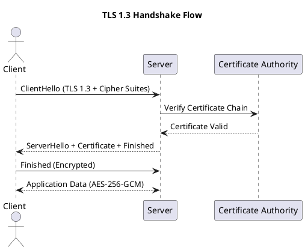
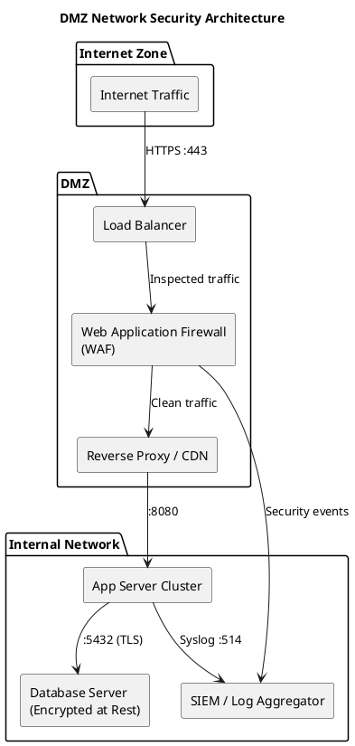
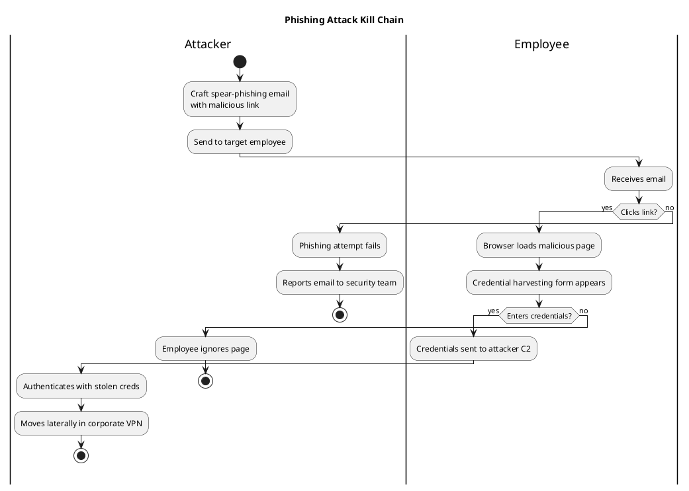
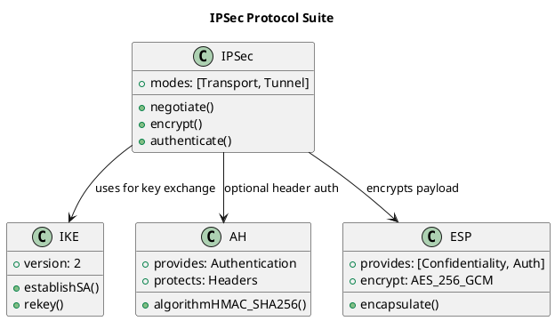
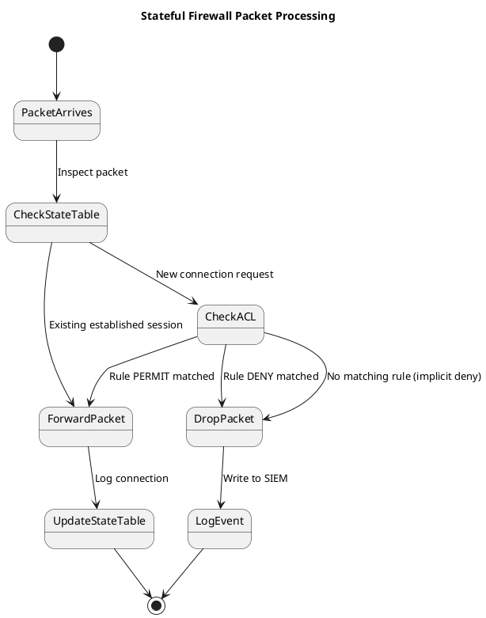

# CertNova Admin Content Authoring Guide

> **Who is this for?** Course authors and administrators who write lesson content in the Admin Dashboard → Course content tab.

---

## Table of Contents

- [Headings](#headings)
- [Paragraphs & Inline Formatting](#paragraphs--inline-formatting)
- [Bullet & Numbered Lists](#bullet--numbered-lists)
- [Blockquotes (Professor Tips)](#blockquotes-professor-tips)
- [Code Snippets](#code-snippets)
- [Tables](#tables)
- [PlantUML Architecture Diagrams](#plantuml-architecture-diagrams)

---

## Headings

Use `###` for section headings inside a lesson (the lesson title is auto-rendered as `h1`).

```
### 1. Core Technical Breakdown
### 2. Real-World Analogy
### 3. Attack & Defense Lab Scenario
### 4. Professor's Deep-Dive Notes
```

---

## Paragraphs & Inline Formatting

Plain text automatically becomes paragraphs. Use inline markers:

| Syntax | Renders As |
| :----- | :--------- |
| `**bold**` | **bold** |
| `*italic*` | *italic* |
| `` `inline code` `` | `inline code` |

> **Important:** Do NOT bold the explanation text that follows a bullet point dash. Only bold the label/keyword itself.

---

## Bullet & Numbered Lists

```markdown
* **Physical Layer (L1):** The envelope and mail trucks carrying data.
* **Data Link Layer (L2):** The local sorting facility — ARP Poisoning happens here.
* **Network Layer (L3):** The global ZIP code addressing system (IP Spoofing risk).
```

For steps, use ordered lists:

```markdown
1. Install Wireshark on your test machine.
2. Open a capture on your primary interface.
3. Filter by `tcp.flags.syn == 1` to isolate SYN packets.
```

---

## Blockquotes (Professor Tips)

Use `>` for callout boxes — these appear as styled blockquotes in the lesson viewer.

```markdown
> 💡 *Professor's Tip:* Memorize the layer-by-layer attacks for CISSP and Security+. Interviewers love asking at which layer a Next-Generation Firewall operates versus a traditional packet-filtering firewall.
```

---

## Code Snippets

Inline command references: `` `arpspoof -i eth0 -t 192.168.1.5 192.168.1.1` ``

For multi-line terminal commands or config blocks, use fenced code blocks with a language tag:

````markdown
```bash
nmap -sV -p 1-1024 192.168.1.0/24
```
````

````markdown
```python
import socket
s = socket.socket(socket.AF_INET, socket.SOCK_STREAM)
s.connect(('10.0.0.1', 443))
```
````

---

## Tables

Use GFM (GitHub Flavored Markdown) pipe tables. The colons in the separator row control alignment.

```markdown
| OSI Layer | TCP/IP Layer | Primary Protocols | Common Attacks | Countermeasures |
| :--- | :--- | :--- | :--- | :--- |
| **7. Application** | **Application** | HTTP, DNS | SQLi, XSS | WAF, DNSSEC |
| **4. Transport** | **Transport** | TCP, UDP | SYN Floods | Stateful Firewalls |
| **1. Physical** | **Network Access** | Fiber, Hubs | Wiretapping | Physical locks, 802.1X |
```

Tables render with a **warm peach header row**, **zebra-striped rows**, and **hover highlights** automatically — no extra markup needed.

---

## PlantUML Architecture Diagrams

CertNova natively renders **PlantUML** diagrams. Wrap diagram code inside a ` ```plantuml ` fenced block. The diagram is fetched as a scalable SVG from plantuml.com — no images to upload.

### Sequence Diagram (Protocol Flow)

````markdown

````

### Component Diagram (Architecture)

````markdown

````

### Activity Diagram (Attack Flow)

````markdown

````

### Class Diagram (Protocol Structure)

````markdown

````

### State Diagram (Firewall Rule Processing)

````markdown

````

---

## Quick Reference: Tips for Great Lesson Content

| Do | Avoid |
| :- | :---- |
| Use `###` numbered sections like `### 1. Core Technical Breakdown` | Using `##` which creates oversized headings |
| Bold only the keyword/label in bullet points | Making the full explanation sentence bold |
| Add a Professor's Tip blockquote per lesson | Long paragraphs with no structure |
| Use PlantUML for attack flows, architecture maps | Uploading screenshots of diagrams |
| Horizontal rule `---` at end of each lesson file | Ending mid-sentence or with empty bullets |

---

*This guide is maintained by the CertNova content team. For questions, open a GitHub issue or ping the lead instructor.*
