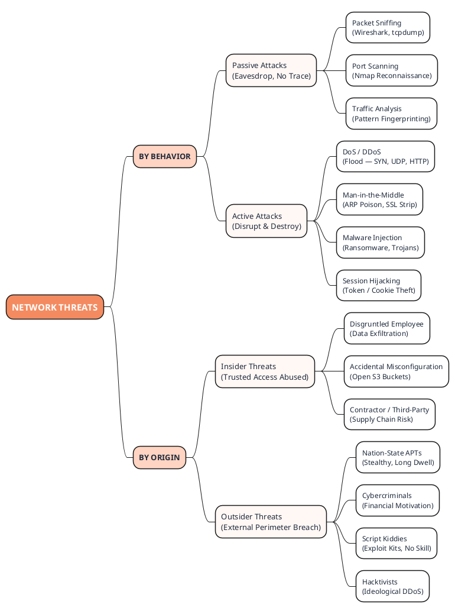

# 1.2 Types of Network Threats & Attack Vectors

### 1. Core Technical Breakdown
Threats are categorized by their behavior (**Passive vs. Active**) and their point of origin (**Insider vs. Outsider**).

* **Passive Attacks:** The attacker intercepts or monitors data without altering system resources. The objective is eavesdropping or traffic analysis. Examples: Packet sniffing (Wireshark), port scanning (Nmap). These are incredibly difficult to detect because they leave no operational footprint.
* **Active Attacks:** The attacker alters system resources, injects malicious code, or disrupts network operations. Examples: Man-in-the-Middle (MITM), Denial of Service (DoS), SQL Injection, session hijacking. These are detected via anomalies, system crashes, or alerts.
* **Insider Threats:** Threats originating from within the organization (employees, contractors, partners). This is highly dangerous because insiders already possess authorized access and knowledge of internal network topologies.
* **Outsider Threats:** Threats originating outside the perimeter boundary (e.g., script kiddies, hacktivists, organized cybercrime syndicates, nation-state Advanced Persistent Threats [APTs]).

### 2. Real-World Analogy
* **Passive Attack:** A spy sitting in a coffee shop with a directional microphone, quietly listening to a CEO discuss quarterly earnings. The CEO has no idea they are being overheard because the spy isn't interrupting the conversation.
  > *Real life example:* A spy sitting in a coffee shop with a directional microphone, quietly listening to a CEO discuss quarterly earnings. The CEO has no idea they are being overheard because the spy isn't interrupting the conversation.
* **Active Attack:** The spy jumps out of their seat, physically grabs the CEO’s phone out of their hand, throws it in a blender, and runs away. The conversation is broken, and a resource is destroyed.
  > *Real life example:* The spy jumps out of their seat, physically grabs the CEO’s phone out of their hand, throws it in a blender, and runs away. The conversation is broken, and a resource is destroyed.
* **Insider Threat:** The bank's trusted nighttime security guard, who has the keys to the vault, turning off the cameras and stealing cash.
  > *Real life example:* The bank's trusted nighttime security guard, who has the keys to the vault, turning off the cameras and stealing cash.
* **Outsider Threat:** A bank robber attempting to blow open the front glass doors with explosives from the street.
  > *Real life example:* A bank robber attempting to blow open the front glass doors with explosives from the street.

### 3. Attack & Defense Lab Scenario
* **The Attack (Insider Malice):** A disgruntled database administrator exports a company's entire customer table to a CSV file and attempts to exfiltrate it via an encrypted SFTP connection to an external personal server.
  > *Real life example:* A disgruntled database administrator exports a company's entire customer table to a CSV file and attempts to exfiltrate it via an encrypted SFTP connection to an external personal server.
* **The Defense (Data Loss Prevention & UEBA):** The security team implements a Data Loss Prevention (DLP) system integrated with User and Entity Behavior Analytics (UEBA). The DLP system flags the massive database export as anomalous behavior for that specific hour, blocks the outbound SFTP connection based on policy rules, and immediately suspends the employee’s Active Directory account.
  > *Real life example:* The security team implements a Data Loss Prevention (DLP) system integrated with User and Entity Behavior Analytics (UEBA). The DLP system flags the massive database export as anomalous behavior for that specific hour, blocks the outbound SFTP connection based on policy rules, and immediately suspends the employee’s Active Directory account.

### 4. Professor's Deep-Dive Notes
>  *Professor's Tip:* Never fall into the trap of focusing 100% of your budget on your external perimeter firewall. The perimeter is a eggshell - hard on the outside, soft on the inside. Once an outsider bypasses your firewall (via phishing or a zero-day exploit), or if an insider decides to turn rogue, they have free rein over your entire interior network if you haven't implemented internal segmentation and strict access monitoring!

---